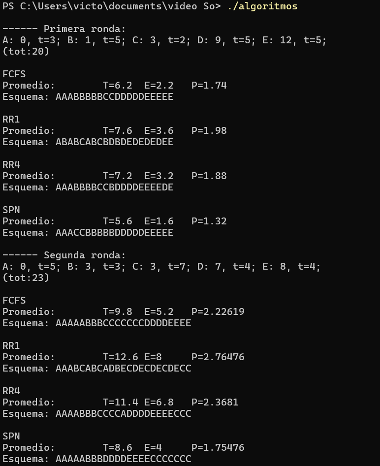

# Tarea 3: Comparación de planificadores
 **Autor:** Brena de León Victor Javier

 ## 1. Descripción
Este programa compara los algoritmos fundamentales de planificación de procesos utilizados por los sistemas operativos para gestionar el tiempo de CPU. El simulador genera pruebas aleatorias con procesos evaluando el desempeño de cada algoritmo a partir de métricas.

El programa simula los siguientes algoritmos 
- FCFS (First-Come, First-Served): Algoritmo que procesa las tareas en el orden de su llegada.

-  Round Robin (q=1): Algoritmo con un quantum de tiempo de 1 unidad.

- Round Robin (q=4): Round Robin con un quantum mayor.

- SPN (Shortest Process Next): Algoritmo que selecciona el proceso con el tiempo más corto disponible.

Dada algoritmo calcula y muestra las siguientes métricas promedio:
- T(Tiempo de Retorno): Tiempo total desde la llegada del proceso hasta su finalización .
- E(Tiempo de Espera): Tiempo que el proceso permaneció en la cola de listos.
- P(Penalización): Proporción del tiempo de retorno respecto al tiempo de servicio .

## 2. Instrucciones de compilación/ejecución
- Es necesario tener instalado c++.
- Seguido compilar desde la terminal:
```
c++ algoritmos.cpp -o algoritmos
```
- Ahora se ejecuta:
```
./algortimos
```

## 3. Ejemplos de salida
Pruebas de ejemplo.




## 4. Áreas de Mejora y Observaciones
- El programa no se utilizaron Colas múltiples para simular sistemas operativos modernos, solo se desarrollaron de forma aislada cada uno de los algoritmos.

- El algoritmos FCFS, puede generar que se dispare el tiempo de espera(E) ya que si justo llega un proceso despues de uno largo, genera mucha espera.

- El algoritmo de RR es mas constante con un q pequeño, pero si el q se aumenta termina pareciendose a FCFS.

- El algoritmos SPN  tiene el tiempo de espera(E) y el tiempo de tiempo de retorno(T) mas chicos a diferencia de los otros dos, esto pasa con procesos pequeños, aunque puede que con procesos grandes ya no se tan eficiente.