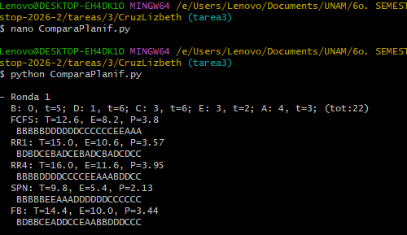

#Tarea #3
#Comparación de planificadores

Este programa simula el comportamiento de un sistema operativo al momento de planificar procesos.
Se generan procesos de manera aleatoria y se ejecutan utilizando diferentes algoritmos de planificación:

- FCFS (First Come First Served)
- Round Robin (quantum = 1 y quantum = 4)
- SPN (Shortest Process Next)
- FB (Feedback Multinivel)

#1. Objetivo
Realizar una comparación del rendimiento de cada algoritmo mediante métricas de tiempo

#2. Descripción del progama
Para representar los procesos, se piensa en una lista donde serán almacenados y se ordenan por tiempo de llegada.
Lista, esta compuesta por: ["A", 0, 5]

"A" --> nombre del proceso
0   --> Tiempo de llegada
5   --> Tiempo de ejecución

Para generar los procesos, se define una función con valores aleatorios, es la razón por la que se importa la biblioteca "random".
Para la llegada se define valores entre 0 y 5 y para el caso de la duración se define entre 1 y 6.

Una comparación esta integrada por valores cuantificables, por ello se debe defnir una función que permita el cálculo de las métricas, usando los valores:
- T: tiempo total desde que llega el proceso hasta que termina.
- E: Tiempo de espera, es el tempo que el proceso permanece en cola.
- P: Penalización, es la relación entre el tiempo total y tempo de ejecución.
Para las métricas se calcula el promedio para cada uno de los procesos.

#2.1 Algoritmos implementados para cada mecanismo
**2.1.1 FCFS:**
Este mecanismo tiene la característica de ejecutar los proesos en el orden en que llegan, no interrumpe procesos, pero puede generar tiempos de espera altos. 
Lo que hace en resumen, ejecuta un proeso completo antes de pasar al siguiente.

**2.1.2 Round Robin (RR)**
Usa una cola de procesos
Cada proceso se ejecuta por un tiempo fijo llamado quantum
Si no termina, vuelve al final de la cola

Se implementan dos variantes:
RR con quantum = 1
RR con quantum = 4

Funcionamiento:
Se van agregando procesos conforme llegan
Se ejecutan por turnos
Se repiten hasta que todos terminan

**2.1.3 SPN (Shortest Process Next)**
Selecciona el proceso con menor duración disponible
No interrumpe procesos
Mejora el tiempo promedio

Funcionamiento:
Se almacenan procesos disponibles
Se ordenan por duración
Se ejecuta el más corto

**2.1.4 FB (Feedback Multinivel)**
Usa varias colas con diferentes prioridades
Los procesos nuevos entran en la cola de mayor prioridad
Si usan mucho CPU, bajan de nivel

Configuración:
3 niveles de colas
Quantums: 1, 2 y 4

Funcionamiento:
Procesos cortos tienden a terminar rápido
Procesos largos bajan de prioridad

#3. Ejecución
python ComparaPlanif.py

#3.1 Representación
Al ser ejecutado los procesos y haber realizado las metricas para cada uno de ellos, el programa muestra una línea como:

'AAABBBCC'

Donde cada letra representa el proceso que se está ejecutando en cada unidad de tiempo.
Esto permite visualizar cómo trabaja cada algoritmo.

#3.2 Rondas
El programa ejecuta 5 rondas:

for ronda in range(5):

En cada ronda:
Se generan nuevos procesos
Se calcula el total de duración (tot)
Se ejecutan todos los algoritmos
Se imprimen resultados

Ejemplo:

A: 0, t=3; B: 1, t=5; (tot:8)
A y B, nombre de los procesos.
0 y 1: corresponde al tiempo de llegada, claro estos cambiaran segun el random.
t: corresponde al tiempo de ejecución (duración).
tot: es la suma de los tiempos de cada proceso, como se muestra en el ejemplo.

#4. Comparación de resultados
Para comparar algoritmos se analizan:
Menor T → mejor tiempo de finalización
Menor E → menor espera
Menor P → mayor eficiencia

Esto permite observar qué algoritmo se comporta mejor según la carga.

#4.1 Comprobación FCFS
Para comprobar que en efecto el algoritmo propuesto en este programa en realidad si ralice lo que se se pide, se hace una comparación.
Se ejecuta el programa y se toma  de la Ronda 1, los resultados para FCFS y se lleva a cabo manualmente el proceso y validar el obenido por este progrma.
Ver la imagen adjunta a este README.(Ronda1 FCFS.png)

Ronda 1:
B: 0, t=5
D: 1, t=6
C: 3, t=6
E: 3, t=2
A: 4, t=3
(tot:22)
La suma de ls tiempos es: 5 + 6 + 6 + 2 + 3 = 22, por lo tanto se cumple con el obtenido.

Ahora, para FCFS:
El orden dellegada es: B → D → C → E → A, es importante mencionar que C y E llegan al mismo tiempo (3), pero C va primero porque aparece antes en la lista.

La visualiación de este resultado es: BBBBBDDDDDDCCCCCCEEAAA, (recordemos que cada caracter es equivalente a una unidad de tiempo).
Entoncee, se ordenenarn para visualizar el proceso, llegada y finalización.
Proceso		unidad tiempo	inicio	fin
B		5		0	5
D		6		5	11
C		6		11	17
E		2		17	19
A		3		19	22

Cálculos:
T = fin - llegada
E = T - duración
P = T/duración

Proceso B:
T = 5 - 0 = 5
E = 5 - 5 = 0
P = 5 / 5 = 1

Proceso D:
T = 11 - 1 = 10
E = 10 - 6 = 4
P = 10 / 6 ≈ 1.67

Proceso C:
T = 17 - 3 = 14
E = 14 - 6 = 8
P = 14 / 6 ≈ 2.33

Proceso E:
T = 19 - 3 = 16
E = 16 - 2 = 14
P = 16 / 2 = 8

Proceso A:
T = 22 - 4 = 18
E = 18 - 3 = 15
P = 18 / 3 = 6

Obtención de promedios
T promedio:
(5 + 10 + 14 + 16 + 18) / 5 = 63 / 5 = 12.6 :)

E promedio:
(0 + 4 + 8 + 14 + 15) / 5 = 41 / 5 = 8.2  :)

P promedio:
(1 + 1.67 + 2.33 + 8 + 6) / 5 ≈ 3.8  :)

Resultado para FCFS: T=12.6, E=8.2, P=3.8 :)
Cumple con lo obtenido en la ejecuión, ver imagen Ronda1 FCFS.png

Conclusión de los resultados: El proceso E, tiene mucho tempo de espera (14) y una alta penalización (8), esto nos compreuba que FCFS no considera duración, sólo orden de llegada.

#5. Conclusión
Este programa demuestra que el rendimiento de los algoritmos de planificación depende de la carga de trabajo.
El uso de múltiples rondas permite obtener resultados más confiables y comparar tendencias, en lugar de depender de un solo caso.
Además, se observa que algoritmos más complejos como FB pueden ofrecer mejores resultados en escenarios variados.

