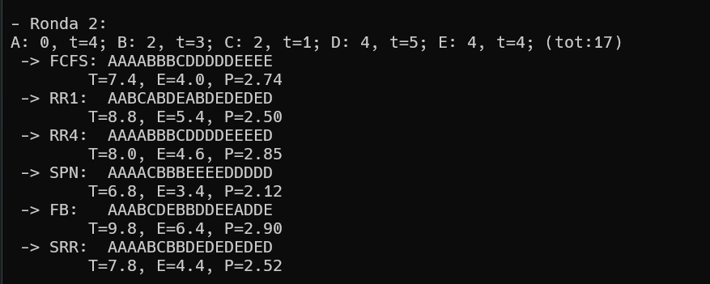
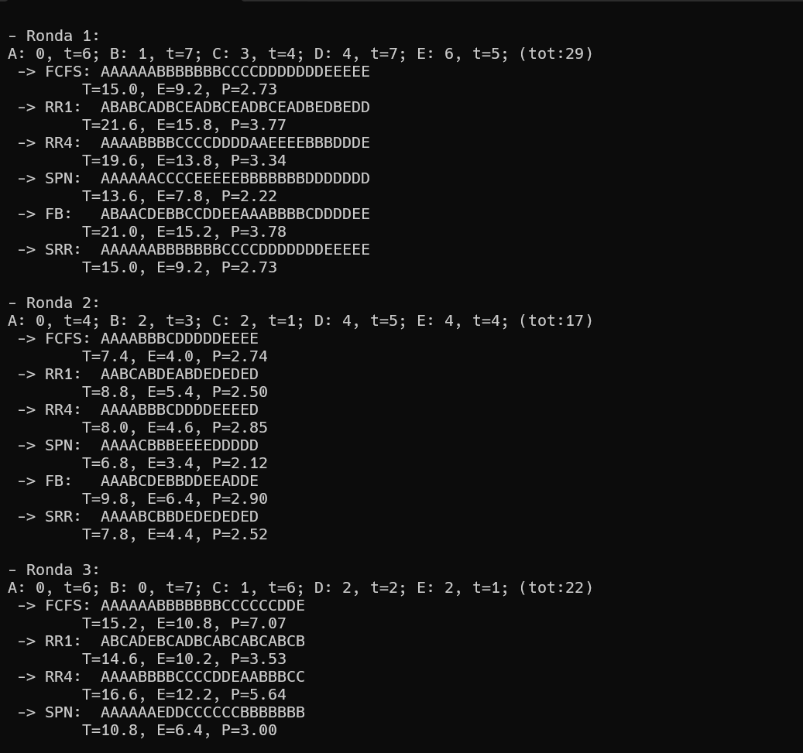
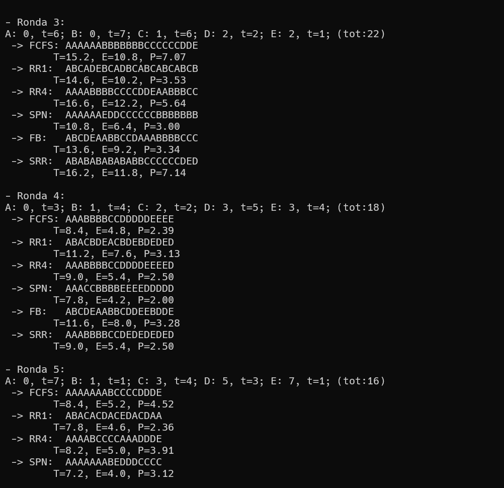

# Tarea 3: Comparación de planificadores

---

**Tarea planteada:** 2026.04.09
**Entrega**: 2026.04.16

**Alumnos:**

* Monroy Tapia Jesús Alejandro
* Ponce de León Reyes Bruno

---

## Objetivo

El objetivo de esta tarea es implementar y analizar el desempeño de diversos algoritmos de planificación de CPU (**FCFS, RR, SPN, FB y SRR**) mediante una herramienta de simulación desarrollada en lenguaje C. A través de la generación de cargas de trabajo aleatorias y la comparación de múltiples ejecuciones, se busca evaluar cuantitativamente el impacto de cada política sobre métricas críticas de rendimiento, tales como el tiempo de retorno (**T**), el tiempo de espera (**E**) y la proporción de penalización (**P**).

Asimismo, el proyecto pretende visualizar gráficamente la línea de tiempo de ejecución para comprender el comportamiento de conceptos como la **apropiación de procesos**, la gestión de colas de prioridad multinivel y el compromiso (*trade-off*) entre la justicia distributiva del procesador y la eficiencia global del sistema bajo condiciones de saturación estable.

---

### Requisitos e instrucciones para ejecución

Para poder ejecutar el programa es necesario utilizar un compilador `gcc` para compilar el programa, de manera que posteriomente se pueda ejecutar.

* **Pasos para ejecución**:

1. Compilar el archivo de extensión .c con gcc

```bash

gcc planificadores.c -o planificadores

```

2. Si es necesario, brindarle permisos de ejecución al programa con chmod

```bash

chmod +x planificadores

```

3. Ejecutar el programa

```bash

./planificadores

```

---

## Explicación del programa

El presente programa tiene como objetivo simular y comparar el comportamiento de distintos algoritmos de planificación de procesos en sistemas operativos. Para ello, se generan múltiples cargas de trabajo de manera aleatoria, cada una compuesta por procesos con distintos tiempos de llegada y ráfagas de ejecución, permitiendo evaluar el desempeño de cada algoritmo bajo condiciones variables.

A lo largo de varias rondas, se implementan y ejecutan algoritmos clásicos como FCFS, Round Robin y SPN, así como algoritmos más avanzados como retroalimentación multinivel (FB) y ronda egoísta (SRR). Para cada uno, el programa calcula métricas fundamentales como el tiempo de retorno (T), tiempo de espera (E) y la penalización (P), además de representar visualmente la secuencia de ejecución de los procesos.

De esta manera, el programa no solo permite observar el funcionamiento interno de cada algoritmo, sino también analizar sus diferencias en términos de eficiencia y equidad, facilitando una comparación más completa y representativa de su desempeño.

---

## Algoritmos empleados para la solución

* **First Come First Served (FCFS)**

Este planificador de procesos únicamente se encarga de poner en ejecución a los procesos conforme van llegando a la cola de procesos, es decir, sin importar sus características siempre se usará una ejecución secuencial de la cola de procesos.

* **Ronda o "Round Robin" (RR)**

El algoritmo establece el tiempo (en quantums) en el que cada proceso se va a ejecutar, una vez que termina este tiempo se cambiará de proceso. Este procedimiento se repetirá conforme sigan llegando procesos. El cambio entre procesos provoca un gran número de cambio de contextos en el sistema, lo cual implica un gasto de recursos y una alta actividad administrativa.

Para esta tarea se estableció un tiempo de *un quantum* para la ejecución de procesos, cada quantum tiene una duración de 30 ms.

* **Shortest Process Next (SPN)**

Este algoritmo busca los procesos de menor duración, siendo estos los de mayor preferencia para que otorgarles la ejecución. Como consecuencia este algoritmo le da favoritismo a los procesos cortos, los procesos largos pueden llegar a sufrir inanición en algunos casos.

En el caso de este programa ya se tiene conocimiento del tiempo de ráfaga de cada proceso, por lo que será a partir de este tiempo que se seleccionan los procesos a ejecutar.

* **FeedBack (FB)**
  Este algoritmo utiliza múltiples colas de prioridad para organizar los procesos, donde cada cola tiene un quantum diferente, generalmente creciente (por ejemplo, 1, 2, 4, ...). Los procesos nuevos comienzan en la cola de mayor prioridad y, si no terminan su ejecución dentro del quantum asignado, son degradados a colas de menor prioridad.

Este mecanismo favorece a los procesos cortos, ya que tienden a finalizar en las colas superiores con quantums pequeños, mientras que los procesos largos son progresivamente desplazados hacia colas inferiores donde reciben más tiempo de CPU pero con menor prioridad. De esta manera, el algoritmo logra un equilibrio entre eficiencia y equidad, evitando que los procesos largos monopolicen el sistema sin llegar a bloquearlos completamente.

* **Selfish Round Robin(SRR)**
  El algoritmo de Ronda Egoísta es una variante de Round Robin que introduce un sistema de prioridades dinámicas para controlar el acceso de los procesos a la CPU. En este esquema, los procesos se dividen en dos grupos: procesos activos (que ya están en ejecución) y procesos nuevos (que esperan ser aceptados).

Cada proceso cuenta con una prioridad que aumenta con el tiempo. Sin embargo, las prioridades de los procesos activos crecen a una tasa mayor que las de los procesos nuevos. Un proceso nuevo solo puede integrarse a la cola de ejecución cuando su prioridad alcanza o supera la de los procesos activos con menor prioridad.

Este enfoque permite favorecer a los procesos que ya están siendo atendidos, evitando cambios constantes de contexto, pero al mismo tiempo garantiza que los procesos nuevos eventualmente accedan al CPU, evitando la inanición. Como resultado, SRR ofrece un balance entre la equidad de Round Robin y el control de prioridades, aunque su desempeño depende de los parámetros utilizados para el crecimiento de prioridades.

---

## Revisión manual



Ahora a continuación realizaremos la revisión manual de los resultados presentados en la primera ronda para los algoritmos de FCFS, RR1 y SPN, esto con el fin de comprobar que nuestro programa implementado en C, es correcto y que cumple con la teoría dada en clase para esto vamos a obtener las métricas T, E y P.

1. FCFS

FCFS: AAAABBBCDDDDDEEEE


| Proceso  | Llegada | t | Inicio | Fin | T   | E  | P     |
| -------- | ------- | - | ------ | --- | --- | -- | ----- |
| A        | 0       | 4 | 0      | 4   | 4   | 0  | 1     |
| B        | 2       | 3 | 4      | 7   | 5   | 2  | 1.67  |
| C        | 2       | 1 | 7      | 8   | 6   | 5  | 6.00  |
| D        | 4       | 5 | 8      | 13  | 9   | 4  | 1.80  |
| E        | 4       | 4 | 13     | 17  | 13  | 9  | 3.25  |
| Suma     |         |   |        |     | 37  | 20 | 13.72 |
| Promedio |         |   |        |     | 7.4 | 4  | 2.744 |

1. RR1

RR1:  AABCABDEABDEDEDED


| Proceso  | Llegada | t | Inicio | Fin | T   | E   | P     |
| -------- | ------- | - | ------ | --- | --- | --- | ----- |
| A        | 0       | 4 | -      | 9   | 9   | 5   | 2.25  |
| B        | 2       | 3 | -      | 10  | 8   | 5   | 2.67  |
| C        | 2       | 1 | -      | 4   | 2   | 1   | 2.00  |
| D        | 4       | 5 | -      | 17  | 13  | 8   | 2.60  |
| E        | 4       | 4 | -      | 16  | 12  | 8   | 3.00  |
| Suma     |         |   |        |     | 44  | 27  | 12.52 |
| Promedio |         |   |        |     | 8.8 | 5.4 | 2.504 |

1. SPN

SPN:  AAAACBBBEEEEDDDDD


| Proceso  | Llegada | t | Inicio | Fin | T   | E   | P     |
| -------- | ------- | - | ------ | --- | --- | --- | ----- |
| A        | 0       | 4 | 0      | 4   | 4   | 0   | 1.00  |
| B        | 2       | 3 | 5      | 8   | 6   | 3   | 2.00  |
| C        | 2       | 1 | 4      | 5   | 3   | 2   | 3.00  |
| D        | 4       | 5 | 12     | 17  | 8   | 4   | 2.00  |
| E        | 4       | 4 | 8      | 12  | 13  | 8   | 2.60  |
| Suma     |         |   |        |     | 34  | 17  | 10.60 |
| Promedio |         |   |        |     | 6.8 | 3.4 | 2.12  |

Con estás tres tablas realizadas de forma manual podemos ver que el promedio de las métricas de T, E y P son iguales a las que devuelve el programa, por lo que podemos confirmar que los resultados que brinda el programa son correctos y de acuerdo a cada algoritmo realizado en el código en lenguaje C.

---

## Ejemplo de ejecución

A continuación mostramos la ejecución del programa en la terminal.





---

## Conclusiones

A partir de las cinco rondas ejecutadas, se puede ver que cada algoritmo tiene un comportamiento bastante consistente, lo que permite notar claramente sus ventajas y desventajas de cada uno de ellos a partir de las métricas de T, E y P.

En general, SPN fue el que mejor números tuvo, ya que en la mayoría de las rondas obtuvo los valores más bajos de T y E. Esto se debe a que siempre prioriza los procesos más cortos, como su nombre lo dice, lo que hace que el sistema sea más eficiente.

Por otro lado, FCFS es el más simple de los algoritmos mostrados, pero también uno de los menos eficientes cuando hay procesos largos al inicio. Como se observa en varias rondas, un proceso grande puede retrasar a todos los demás, generando tiempos de espera más altos.

En el caso de Round Robin, especialmente con quantum pequeño (RR1), se logra una ejecución más equitativa, ya que todos los procesos avanzan poco a poco. Sin embargo, esto provoca muchos cambios de contexto, lo que termina aumentando los tiempos promedio. Cuando el quantum es mayor (RR4), el comportamiento mejora un poco, pero empieza a parecerse más a FCFS.

Finalmente, los algoritmos como FB y SRR muestran un comportamiento intermedio. FB intenta balancear la ejecución entre procesos cortos y largos mediante prioridades, mientras que SRR controla el acceso a la CPU usando prioridades dinámicas. En general, ambos logran un equilibrio aceptable, aunque sus resultados pueden variar dependiendo de la carga de trabajo.

En conclusión, no hay un algoritmo perfecto. Cada uno funciona mejor en ciertos escenarios: SPN es más eficiente, RR es más justo, y FB y SRR buscan un punto medio entre ambos.

---

## Referencias

[1]“Planificacion de procesos: Algoritmos de planificacion | IIEc,” *Unam.mx*, 2026. Available: [https://docencia.iiec.unam.mx/pluginfile.php/8559/mod\_resource/content/1/08\_algoritmos\_planif\_proc.pdf](https://docencia.iiec.unam.mx/pluginfile.php/8559/mod_resource/content/1/08_algoritmos_planif_proc.pdf)

‌
