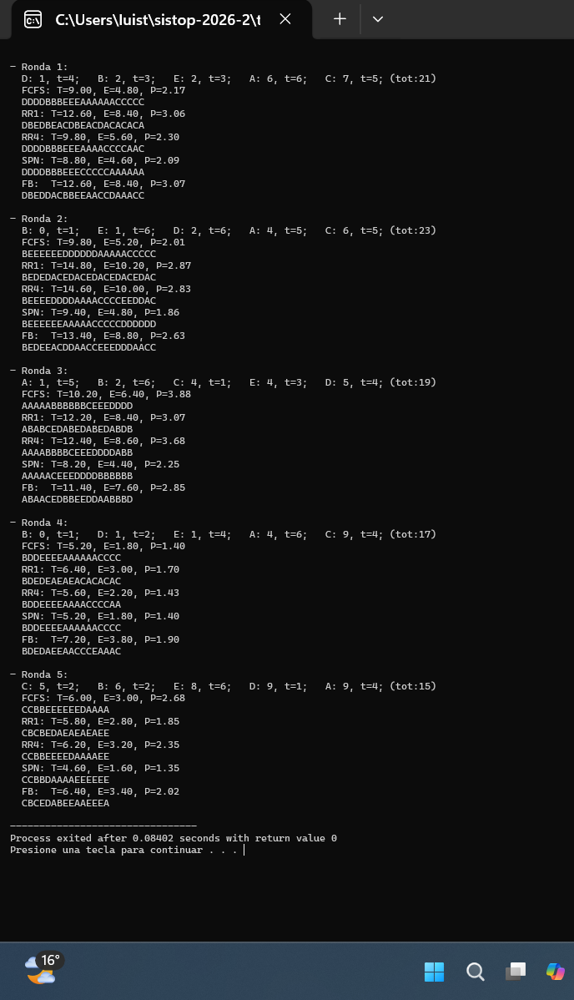

# Tarea 3 - Comparación de planificadores

**Integrantes:**
- Torres Lozano Luis
- Zavala Magaña Luis

---

## ¿Qué hace el programa?

Genera cinco rondas con procesos aleatorios y les aplica cinco algoritmos
de planificación: FCFS, RR (quantum 1 y 4), SPN y FB (retroalimentación
multinivel). Para cada ronda imprime las métricas de rendimiento T, E, P
y el diagrama de Gantt correspondiente.

## Compilación y ejecución

```bash
gcc -o compara_planif compara_planif.c
./compara_planif
```

## Algoritmos implementados

- **FCFS** (First Come First Served): atiende los procesos en orden de
  llegada, sin interrupciones.
- **RR1 / RR4** (Round Robin): da a cada proceso listo un turno de 1 o 4
  unidades de tiempo y rota en orden de llegada.
- **SPN** (Shortest Process Next): en cada decisión escoge el proceso listo
  con la ráfaga más corta. No apropiativo.
- **FB** (Feedback multinivel): usa varias colas con prioridad decreciente.
  El quantum de la cola k es 2^k. Si un proceso no termina en su quantum,
  baja a la siguiente cola, penalizando automáticamente a los procesos largos.

## Métricas

- **T** (tiempo de retorno): tiempo total desde que llega el proceso hasta
  que termina.
- **E** (tiempo de espera): tiempo que el proceso estuvo listo pero sin CPU.
- **P** (penalización): razón entre el tiempo de retorno y la duración real
  del proceso.

## Verificación manual

Verificamos manualmente la Ronda 4 de la evidencia:
`B: 0, t=1; D: 1, t=2; E: 1, t=4; A: 4, t=6; C: 9, t=4`

**FCFS:** B llega en 0 y dura 1 → `B`, D llega en 1 → `DD`, E llega en 1
pero D ya corrió → `EEEE`, A llega en 4 → `AAAAAA`, C llega en 9 → `CCCC`.
Resultado: `BDDEEEEAAAAAACCCC` → T=5.20, E=1.80, P=1.40 ✓

**SPN:** en t=1 están listos D(2) y E(4), gana D. En t=3 solo está E,
corre E. En t=7 llega A(6), corre A. En t=13 llega C(4), corre C.
Resultado: T=5.20, E=1.80, P=1.40 ✓

## Dificultades encontradas

La parte más compleja fue implementar FB, ya que requiere mantener el nivel
de cola de cada proceso y calcular el quantum dinámicamente como 2^k. Al
principio no considerábamos que un proceso recién llegado podía tener mayor
prioridad que uno que ya había bajado de cola, lo cual se resolvió buscando
siempre el proceso listo con menor número de cola antes de cada ejecución.

## Evidencia de ejecución


